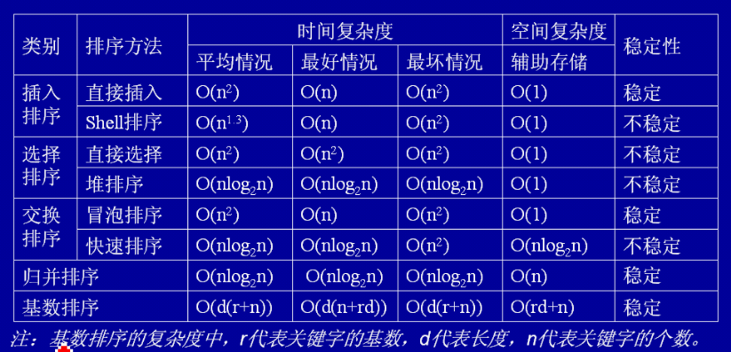

[TOC]

# 匠心之路

> 观点：科技公司 “价值导向，业务选型（产品），管理（项目）整合，技术创新” 的。
>
> 做事心态：脚踏实地、仰望星空。
>
> 为人处事的哲学：道法术器势。“道以明向，法以立本，术以立策，势以立人，器以成事。”

### 前言

本文重点偏于“器”，然而“道可道，非常道”，术可以学，道只能靠悟。希望大家通过砺器、学术，悟出安家立业的道。以此共勉。

以下是根据我曾经所在公司的经历总结，供研发团队参考。以通用优先，各平台特有补充。后续会随时调整补充。

## 企业

创业是以融资支撑指数型增长的爆发领域的事情。

### 企业要素

> 一个创业项目成功，技术只是各个条件中一环。用户体验打磨、营销各种因素的综合，甚至运气占非常重要的成分。在 2B 领域，客户选择一个产品，会有很多综合考量，例如产品特色、实施成本、维护服务等，并不仅仅是产品功能和公司规模能决定的。

### 视野·事业

## 管理

> 老子云：“太上，不知有之；其次，亲而誉之；其次，畏之；其次，侮之。”
>
> 公司成长业务增加，核心的关键是让优秀人才的密度超过业务复杂度的增加。

*详见：附录「2016码会」张一鸣：为何不赞同控制人力成本*

## 团队协作（项目管理）

> 团队协作的核心是项目管理，其他工具需要配合项目管理平台来选择。
>
> 利益相关者：发起方、项目经理、产品、交互、视觉、前端和后端
>
> 最佳实践的3个平台：PRD和Demo分享平台；整合了Sketch、图标库、可输出npm包和（SVG格式）设计稿分发的 Living Style Guide 平台；需求和缺陷跟踪平台

- 项目管理方式：Agile Project Management（Scrum、Kanban、XP、Lean）、PMP
- 协调团队间工作：[ZenHub](https://www.zenhub.com/)、[Trello](https://trello.com/)、[Slack](https://slack.com/)、[Redmine](http://www.redmine.org/projects/redmine/wiki/Download)（需求过程管理）、[Confluence](https://www.atlassian.com/software/confluence)（需求内容管理）teambition、Gantter、HackPad、Mantis
- 任务排期：[OmniPlan](https://www.omnigroup.com/omniplan)、[Microsoft Project](https://products.office.com/en-us/project/project-and-portfolio-management-software)
- PRD 协作和分享平台：OmniGraffle、Axure
- 交互稿：Sketch、
- 原型：Axure、[Fuse](https://www.fusetools.com/)
- Living Style Guide平台：[getstorybook](https://getstorybook.io/)（支持React Native）、[Styleguide](https://github.com/hugeinc/styleguide/)、Styleguide
- 图标库：[CSSIcon](https://github.com/wentin/cssicon)、[阿里巴巴矢量图标库](http://iconfont.cn/)、[icons8 animated icons](https://github.com/icons8/titanic)
- 文件共享服务：NAS
- 文档：[Typora](https://typora.io)、[Evernote](https://www.evernote.com/)、MS Office
- 架构图：[OmniGraffle](https://www.omnigroup.com/omnigraffle/)
- 会议与头脑风暴：[Draw.io](https://www.draw.io/)、[MindMup](https://www.mindmup.com/)、[百度脑图](http://naotu.baidu.com/)、[ProcessOn](https://www.processon.com/)、MindNode、XMind、Mindjet MindManager
- 前后端分离后的契约：[Swagger](https://github.com/swagger-api/swagger-codegen)

## 研发

> 组织文化上：公司内部应重视 code review、wiki，重视技术分享，给予并鼓励 20% 个人项目时间；不是内斗纷争、团队方向散乱、技术氛围不浓厚。
>
> 大型应用的编程，一般会遇到性能墙和复杂度墙两类问题。

- 应用程序执行容器： [Docker](https://www.docker.com/)
- 代码仓库：Github、[GitLab](https://about.gitlab.com/)
- Git 代码库命令：[Git Pretty](https://raw.githubusercontent.com/TingGe/develop-tools/master/img/git-pretty.jpg)
- 代码审核：[Phabricator](https://github.com/phacility/phabricator)
- 代码片段分享平台：[ESNextbin](https://esnextb.in/)、[RequireBin](http://requirebin.com/)、[React.run](http://www.react.run/)、[CodePen](http://codepen.io/)
- 规范：[语义化版本 2.0.0](http://semver.org/lang/zh-CN/)、[表述性状态转移（RESTful API）](http://www.ituring.com.cn/tupubarticle/3790)、面向服务架构（SOA）、远程过程调用（RPC）
- 监控应用：[Zabbix](http://www.zabbix.com/)、[Collected](https://collectd.org/)、 [Trace](https://trace.risingstack.com/)
- 实时数据一站式解决方案：ELK stack（[ElasticSearch](https://www.elastic.co/products/elasticsearch)、[Logstash](https://www.elastic.co/products/logstash)、[Kibana](https://www.elastic.co/downloads/kibana)）
- 移动测试缺陷发现和管理：[Bugtags](https://www.bugtags.com/)、[Fabric](https://get.fabric.io/)

### 技术

>  Web 核心：API、JavaScript、Html、CSS
>
>  快速迭代的产品必须有敏捷的技术栈和稳定的框架。

#### JavaScript 应用领域和技术栈

JavaScript 在经历端的融合、栈的融合阶段。JavaScript 可以做很多事情：从前端到全栈，从桌面到移动、物联网，从应用到游戏。然而，其在大数据、高强度计算等等这些考验性能和执行效率的场景并不适用。

| 应用领域          | 技术栈                                      |
| ------------- | ---------------------------------------- |
| 全栈 JavaScript | [React Starter Kit](https://github.com/kriasoft/react-starter-kit)、[MERN](http://mern.io/)、[MEAN](http://mean.io/) |
| 服务器端          | NodeJS                                   |
| 浏览器插件和扩展      | 见 [Extensions和Bookmarklet](https://github.com/TingGe/chrome-extensions/blob/master/README.md) |
| 桌面应用          | [Electron](https://electron.atom.io/)    |
| 移动端           | [React Native](https://facebook.github.io/react-native/)、Hybrid App（Cordova + AngularJS + lonic）、Native、Weex、微信小应用 |
| 游戏            | Cocos2d-js、Unity3D、Pomelo、Bearcat        |
| 物联网           | [Cylon](https://cylonjs.com/)、Arduino、Tessel、[Ruff](https://ruff.io/zh-cn/) |
| 机器学习          | [brain.js](https://github.com/harthur-org/brain.js) (神经网络)、[Synaptic](https://github.com/cazala/synaptic) (神经网络)、[Natural](https://github.com/NaturalNode/natural) (自然语言处理)、[ConvNetJS](http://cs.stanford.edu/people/karpathy/convnetjs/) (卷积神经网络)、 [mljs](https://github.com/mljs) (一组具有多种功能的子库)、[Neataptic](http://dnn%20execution%20framework%20o/) (神经网络)、[Webdnn](https://github.com/mil-tokyo/webdnn) (深度学习)、[Deep playground](https://github.com/tensorflow/playground)、 [FlappyLearning](https://github.com/xviniette/FlappyLearning)、 [Land Lines](https://github.com/ofZach/landlines)、 [Thing Translator](https://github.com/dmotz/thing-translator)、 [Neurojs](https://github.com/janhuenermann/neurojs)、 [Machine_learning](https://github.com/junku901/machine_learning)、[DeepForge](https://github.com/deepforge-dev/deepforge)、[Keras.js](https://transcranial.github.io/keras-js) |

附：[Machine Learning in Javascript: Introduction](http://burakkanber.com/blog/machine-learning-in-other-languages-introduction/)

#### JavaScript 引擎 && 渲染引擎

JavaScript 引擎工作原理是，围绕抽象语法树（AST）， 大致分 parse > transform > generator 三步实现 JavaScript 代码到机器码的转换。

| Browser, Headless Browser, or Runtime    | JavaScript引擎                             | 渲染引擎                                     |
| ---------------------------------------- | ---------------------------------------- | ---------------------------------------- |
| Mozilla                                  | [Spidermonkey](https://developer.mozilla.org/zh-CN/docs/Mozilla/Projects/SpiderMonkey) | [Servo](https://github.com/servo/servo) 或  [Gecko](https://github.com/mozilla/gecko-dev) |
| Chrome                                   | [V8](https://github.com/v8/v8)           | [Blink](https://chromium.googlesource.com/chromium/blink) |
| Safari                                   | [JavaScriptCore](https://github.com/WebKit/webkit/tree/master/Source/JavaScriptCore) | [Webkit](https://github.com/WebKit/webkit) |
| IE and Edge                              | [Chakra](https://github.com/Microsoft/ChakraCore) | EdgeHTML 和  Trident                      |
| TrifleJS                                 | V8                                       |                                          |
| Node.js                                  | V8                                       |                                          |
| [Node.js on ChakraCore](https://github.com/nodejs/node-chakracore) | [Chakra](https://github.com/Microsoft/ChakraCore) |                                          |
| Ruff                                     | [Duktape](http://duktape.org/)           |                                          |

#### JavaScript 编译器

JavaScript 编译器原理同 JavaScript 引擎类似，区别是转换后还是 JavaScript 代码。

如果想看下 AST 可以试下 [AST Explorer](https://astexplorer.net/) 。

| JavaScript compiler                      | 说明                                       |
| ---------------------------------------- | ---------------------------------------- |
| [Prepack](https://prepack.io/)           | 采用局部优化的思路。运行在AST级别，用Babel解析并生成JavaScript源代码 |
| [Closure Compiler](https://developers.google.com/closure/compiler/) | Google 的 JavaScript 代码优化工具               |
| [Babel](https://babeljs.io/)（含 [Babylon](https://github.com/babel/babylon)、[babel-traverse](https://www.npmjs.com/package/babel-traverse)、[babel-generator](https://www.npmjs.com/package/babel-generator) ） | ES6 转 ES5                                |
| [Lebab](https://lebab.io/)               | ES5 转 ES6                                |

### 软件设计模式

> 维基百科：[软件设计模式](https://zh.wikipedia.org/wiki/Category:%E8%BD%AF%E4%BB%B6%E8%AE%BE%E8%AE%A1%E6%A8%A1%E5%BC%8F)
>
> 秉持最简单的**分层**和**依赖规则**开发，就能开发出干净整洁的系统架构。

虽然这些架构在细节处都有一些变化，但是实际上，它们是非常相似的。它们的目标是一样的，将各种实体间的关系进行分离。它们分离操作的方法也是一样的，采用软件分层的方式。它们分的层中至少有一个业务逻辑层，并且有其他的接口层。——摘取自《[架构整洁之道](http://www.cnblogs.com/yjf512/archive/2012/09/10/2678313.html)》

架构特征：

1. 与框架分离
2. 可测试性
3. 与UI的分离
4. 与数据库的分离
5. 与外部结构的分离

#### 软件设计架构

|                                          | 提出时间      | 作者                                       | 说明                                       | 落地实例                                     |
| ---------------------------------------- | --------- | ---------------------------------------- | ---------------------------------------- | ---------------------------------------- |
| [DDD(Domain-driven design)](https://en.wikipedia.org/wiki/Domain-driven_design)/[命令和查询责任分离（CQRS）](http://martinfowler.com/bliki/CQRS.html) | 2004      | Eric Evans/Greg Young                    | DDD 将软件开发分两个阶段：需求交流中发现领域概念，设计成领域模型；由领域模型驱动软件设计，代码实现领域模型。 CQRS  将应用分为：查询部分（查看模型）和命令部分（写入模型）。 业务逻辑层两个组件相互独立地运行。因此，读取模型（Read Model）将会处理用户的查询——在处理能力方面的要求会更少一些，而写入模型（Write Model）将会经历一个很长的处理路径，包括校验、队列、消息以及用户命令要执行的业务规则处理。 | Flux                                     |
| 六边形架构Hexagonal Architecture (也称为 端口和[适配器](http://cpro.baidu.com/cpro/ui/uijs.php?rs=1&u=http%3A%2F%2Fwww%2Ejdon%2Ecom%2Fartichect%2Fthe%2Dclean%2Darchitecture%2Ehtml&p=baidu&c=news&n=10&t=tpclicked3_hc&q=banq_cpr&k=%CA%CA%C5%E4%C6%F7&k0=%CA%FD%BE%DD%BF%E2&kdi0=8&k1=%BF%D8%D6%C6%C6%F7&kdi1=8&k2=%D4%B4%B4%FA%C2%EB&kdi2=1&k3=%CA%CA%C5%E4%C6%F7&kdi3=1&k4=sql&kdi4=8&sid=1e7c4ea576ec9f0b&ch=0&tu=u1683405&jk=bd19187c218e7435&cf=29&fv=14&stid=9&urlid=0&luki=4&seller_id=1&di=128)) | 2005      | [Alistair Cockburn](http://alistair.cockburn.us/Hexagonal+architecture) | 包括三个层，其中最关键是的**领域模型**，包括所有的应用逻辑与规则。在领域层中不会直接引用技术实现。 包围在领域层之外的是**端口层**，负责接收与用例相关的所有请求，这些请求负责在领域层中协调工作。端口层在端口内部作为领域层的边界，在端口外部则扮演了外部实体的角色。 在端口层之外的是**适配器层**，这一层的技术实现负责以某种格式接收输入、及产生输出 |                                          |
| [洋葱图架构 The Onion Architecture](http://jeffreypalermo.com/blog/the-onion-architecture-part-1/) | 2006      | [Jeffrey Palermo](http://jeffreypalermo.com/blog/onion-architecture-part-4-after-four-years/) | 和六边形架构一脉相承，可理解为六边形架构的子集。 常和DDD一起使用。以领域模型为中心，从里到外是**领域模型、领域服务、应用服务**，外面的都会用到里面的内容，最外围的是容易变化的内容，如界面、测试和基础设施（如数据存储等） |                                          |
| [Clean架构](https://www.bbsmax.com/A/pRdBWY3ezn/) | 2012      | [Robert C. Martin](https://sites.google.com/site/unclebobconsultingllc/) | 可看作六边形架构的衍生， 和 The Onion Architecture 异曲同工，对组织大型应用很有参考价值，也有很多语言在实践 |                                          |
| MVC                                      | 1978      | [Trygve Reenskaug](https://zh.wikipedia.org/w/index.php?title=Trygve_Reenskaug&action=edit&redlink=1) | MVC模式在概念上强调 Model, View, Controller 的职责分离。 MVC 应用时会产生很多文件，但带来的可测试性、可扩充性和可维护性，利于单元测试、自动化测试、CI和持续发布 | Smalltalk、Java、.NET、Ruby，JavaScript，Python，PHP，ActionScript 3 |
| DCI                                      | 2000—2008 | James Coplien和Trygve Reenskaug           | DCI 是 MVC 的一种补充。MVC 作为一种范式语言继续用于分离数据和对数据的处理和对数据的展现。OO 衍生出很多概念、模式，DCI 为解决 OO 及 MVC 存在的这些问题而提出。 它试图在 OO 和数据结构+算法的模型寻求平衡，引入函数式编程的概念来解决 OO 中存在的一些问题。常见的概念，如 Mixins、Multiple dispatch、 Dependency injection、Multi-paradigm design、 [Aspect-oriented programming](https://en.wikipedia.org/wiki/Aspect-oriented_programming) (AOP)、 [Role-oriented programming](https://en.wikipedia.org/wiki/Role-oriented_programming) 等 | Self、Smalltalk-Squeak，C ++，C＃，Ruby，JavaScript，Python，Qi4J（Java）， Scala，Perl和PHP |
| BCE模式（Boundary-Control-Entity Patterns）  | ？         | Ivar Jacobson                            | 跟著名的MVC模式（Model-View-Control Pattern）概念相似。将对象分为三类：边界类（boundary class，隔离系统内外）、控制类（control class，控制用例执行期间的复杂运算或者业务逻辑）和实体类（entity class，对应领域概念的类，主要用来保存问题领域中的重要信息，封装了跟数据结构和数据存储有关的变化） |                                          |

附一张 [对比 BCE、MVC 和 3-Tier 的图](./img/VH0W5.jpg)。

#### 展示模式架构

| 展示模式架构  | 说明   |      |
| ------- | ---- | ---- |
| MVP(SC) |      |      |
| MVP(PV) |      |      |
| PM      |      |      |
| MVVM    |      |      |
| MVC     |      |      |

#### 模式

> 模式，帮助你设计API、搭建代码架构、优化性能

1. [API模式](https://github.com/TingGe/knowledge/blob/master/javascript/others/javascript.patterns/api.js)，帮助我们为函数给出更干净的接口，包括

   | 模式   | 说明                     |
   | ---- | ---------------------- |
   | 回调模式 | 传入一个函数作为参数             |
   | 配置对象 | 帮助保持函数的参数数量可控          |
   | 返回函数 | 函数的返回值是另一个函数           |
   | 柯里化  | 新函数在已有函数的基础上再加上一部分参数构成 |

2. [初始化模式](https://github.com/TingGe/knowledge/blob/master/javascript/others/javascript.patterns/init.js)，帮助我们用一种干净的、结构化的方法来做一些初始化工作，通过一些临时变量来保证不污染全局命名空间。包括：

   | 模式      | 说明                                |
   | ------- | --------------------------------- |
   | 即时函数    | 当它们被定义后立即执行                       |
   | 对象即时初始化 | 初始化工作被放入一个匿名对象，这个对象提供一个可以立即被执行的方法 |
   | 条件初始化   | 使分支代码只在初始化时执行一次，而不是在整个程序生命周期中反复执行 |

3. [性能模式](https://github.com/TingGe/knowledge/blob/master/javascript/others/javascript.patterns/performance.js)，帮助提高代码执行速度，包括：

   | 模式    | 说明                        |
   | ----- | ------------------------- |
   | 记忆模式  | 利用函数的属性，使已经计算过的值不用再次计算    |
   | 重定义函数 | 重写自身的函数体，使第二次及后续的调用做更少的工作 |

4. 对象创建模式，包括：

   | 模式                                       | 说明                    |
   | ---------------------------------------- | :-------------------- |
   | [命名空间模式 ＋ 依赖声明模式](https://github.com/TingGe/knowledge/blob/master/javascript/others/javascript.patterns/namespace.js) | 保持全局空间干净、帮助组织代码       |
   | [沙箱模式](https://github.com/TingGe/knowledge/blob/master/javascript/others/javascript.patterns/sanbox.js) | 唯一的全局变量是一个构造函数        |
   | 链式调用模式                                   |                       |
   | [method() 方法](https://github.com/TingGe/knowledge/blob/master/javascript/others/javascript.patterns/method.js) | 将JavaScript变得像基于类的语法糖 |

5. 代码复用模式。

   > “优先使用对象创建而不是类继承”

   | 模式     | 说明                                       |
   | ------ | ---------------------------------------- |
   | 现代继承模式 | [Object.create()](https://github.com/TingGe/knowledge/blob/master/javascript/others/javascript.patterns/create.js) 、借用方法、绑定、[复制属性](https://github.com/TingGe/knowledge/blob/master/javascript/others/javascript.patterns/extend.js)、[混元](https://github.com/TingGe/knowledge/blob/master/javascript/others/javascript.patterns/mix-ins.js) |
   | 类式继承   | [Klass](https://github.com/TingGe/knowledge/blob/master/javascript/others/javascript.patterns/kclass.js) |

6. 设计模式，包括：

   

   | 模式                                       | 说明                                       | 遵循原则           |
   | ---------------------------------------- | ---------------------------------------- | -------------- |
   | [单例模式](https://github.com/TingGe/knowledge/tree/master/javascript/others/javascript.patterns/singleton) | 使用`new`、通过同一个构造函数来创建多个对象时，得到同一个对象的不同引用   |                |
   | [工厂模式](https://github.com/TingGe/knowledge/blob/master/javascript/others/javascript.patterns/factory.js) | 在运行时通过指定字符串来创建指定类型对象的方法                  | 开闭原则（OCP）      |
   | [遍历模式](https://github.com/TingGe/knowledge/tree/master/javascript/others/javascript.patterns/iterator) | 提供一种简单的API（hasNext（）、next（））来访问复杂的有序聚合数据的每个元素 |                |
   | [装饰模式](https://github.com/TingGe/knowledge/tree/master/javascript/others/javascript.patterns/decorate) | 在运行时动态地给一个对象添加一些额外功能                     |                |
   | [策略模式](https://github.com/TingGe/knowledge/tree/master/javascript/others/javascript.patterns/strategy)（对比 [状态模式](https://github.com/TingGe/knowledge/tree/master/javascript/others/javascript.patterns/status)） | API一致情况下，允许在运行时选择策略                      |                |
   | [外观模式（"门面模式"）](https://github.com/TingGe/knowledge/blob/master/javascript/%E4%BA%8B%E4%BB%B6%E7%B3%BB%E7%BB%9F/dom-events/dom-events.js) | 包装通用的或者设计很差的方法来提供一个更方便的API               | 迪米特法则（LoD,LKP） |
   | [代理模式](https://github.com/TingGe/knowledge/tree/master/javascript/others/javascript.patterns/proxy)（对比 适配器模式） | 一个对象充当了另一个对象的接口的角色                       |                |
   | 适配器模式                                    | 将接口转换成客户希望的另外一个接口，使得原本由于接口不兼容而不能一起工作的那些类可以在一起工作 |                |
   | [中介者模式](https://github.com/TingGe/knowledge/blob/master/javascript/others/javascript.patterns/mediator.html) | 各彼此合作的对象通过一个`mediator`（中介者）对象通讯          |                |
   | [观察者模式](https://github.com/TingGe/knowledge/tree/master/javascript/others/javascript.patterns/observer)（“订阅者/发布者”或“自定义事件”） | 创建“可被观察的对象”使它在某个事件发生时通知订阅者的方式            |                |

7. DOM和浏览器中的模式，包括：

   > 遵循分离和渐进增强的思想

   | 类别           | 模式          | 说明                                       |
   | ------------ | ----------- | ---------------------------------------- |
   | DOM编程        | DOM访问       | 避免在循环中访问DOM                              |
   |              |             | 将DOM引用赋给本地变量，然后操作本地变量                    |
   |              |             | 当可能的时候使用selectors API                    |
   |              |             | 遍历HTML collections时缓存length              |
   |              | DOM操作       | [使用文档碎片](https://github.com/TingGe/knowledge/blob/master/javascript/others/javascript.patterns/documentfragment.js) |
   |              |             | “cloneNode父节点＋修改＋replaceChild”           |
   | 事件           | 事件处理        |                                          |
   |              | 事件委托        |                                          |
   | 长时间运行的脚本     |             | setTimeout()                             |
   |              |             | [Web Workers](https://github.com/TingGe/knowledge/tree/master/javascript/others/javascript.patterns/web-workers) |
   | 远程脚本编程       |             | [XMLHttpRequest](https://github.com/TingGe/knowledge/blob/master/javascript/others/javascript.patterns/xhr.html) |
   |              |             | [JSONP](https://github.com/TingGe/knowledge/blob/master/javascript/others/javascript.patterns/jsonp.html) |
   |              |             | 框架（frame）和图片信标（image beacon）             |
   | 部署JavaScript | 合并脚本        |                                          |
   |              | 压缩 + gzip   |                                          |
   |              | 使用CDN + 缓存头 |                                          |
   |              | 加载策略        | HTML5中更好的`async`                         |
   |              | 引入页面脚本的模式   | `<script>`元素的位置                          |
   |              |             | HTTP 分块                                  |
   |              |             | 动态script元素实现非阻塞下载                        |
   |              |             | 插入`<script>`元素                           |
   |              | 减少初始化工作量    | [延迟加载](https://github.com/TingGe/knowledge/blob/master/javascript/others/javascript.patterns/lazy-load.html) |
   |              |             | [按需加载](https://github.com/TingGe/knowledge/blob/master/javascript/others/javascript.patterns/require.js) |
   |              |             | [预加载 JavaScript](https://github.com/TingGe/knowledge/blob/master/javascript/others/javascript.patterns/preload-javascript.js) |

### 数据结构与算法

#### 算法与高级编程语言的关系

算法在高级语言发展了很多年之后，更多地被封装成了独立的函数或者独立的类，开放接口供人调用，然而算法封装得再好也是不能不假思索地使用就能获益的东西，要知道，这些封装只是在一定程度上避免了重复发明轮子而已。

举个实例：JavaScript中数组的sort方法的排序算法，在默认情况下，是由浏览器而不是JavaScript底层决定的。Chrome的JavaScript引擎**v8**，采用不稳定的快速排序算法（看[源代码](https://github.com/v8/v8/blob/master/src/js/array.js#L755)）；Microsoft Edge的JavaScript引擎**Chakra**，采用不稳定的快速排序算法（看[源代码](https://github.com/Microsoft/ChakraCore/blob/master/lib/Common/DataStructures/QuickSort.h)）；Firefox的JavaScript引擎**SpiderMoney**，采用稳定的归并排序算法（[相关Bug讨论](https://bugzilla.mozilla.org/show_bug.cgi?id=715181)）。

《孙子兵法·作战篇》有云，“不尽知用兵之害者，则不能尽知用兵之利”，意思是说，不对用兵打仗的坏处与弊端进行充分了解同样不可能对用兵打仗的好处有足够的认识。算法的应用是一个辩证的过程，不仅在于不同算法间的比较和搭配使用有着辩证关系，在同一个算法中，不同的参数和阈值设置同样会带来大相径庭的结果，甚至影响数据解读的科学性。这一点请大家务必有所注意。

#### 算法正文

> 经典的有：8大排序算法和4大查找算法。

[数据结构可视化](http://www.cs.usfca.edu/~galles/visualization/Algorithms.html)

排序：直接插入、希尔排序，[直接选择](https://github.com/TingGe/knowledge/blob/master/javascript/others/javascript.algorithms/canvas/selection_sort.html)、堆排序，[冒泡排序](https://github.com/TingGe/knowledge/blob/master/javascript/others/javascript.algorithms/canvas/bubble_sort.html)、[快速排序](https://github.com/TingGe/knowledge/blob/master/javascript/others/javascript.algorithms/canvas/quicksort.html)，归并排序，基数排序。

[8大排序算法 JS 示例](https://github.com/TingGe/develop-tools/blob/master/algorithm.md)

查找：顺序查找、快速（折半）查找、分块查找和散列表

|        | 平均查找长度（ n=节点数，分b块，s=n/b）                 | 查找效率 |
| :----- | ---------------------------------------- | ---- |
| 顺序     | (n+1)/2                                  | 低    |
| 快速（折半） | Log2(n+1)-1                              | 高    |
| 分块     | (分块查找索引表)平均查找长度=Log2(n/s+1)+s/2；(顺序查找索引表)平均查找长度=(S2+2S+n)/(2S) | 中    |
| 散列表    | 1                                        | 直接寻址 |

图：// Todo

#### 其它

1. Trie树（又称“字典树”）

#### 示例

1. 数组（[随机打乱一维数组](https://github.com/TingGe/knowledge/blob/master/javascript/others/javascript.algorithms/array/index.html)、[多数问题](https://github.com/TingGe/knowledge/blob/master/javascript/others/javascript.algorithms/array/candidate.html)、[分治法](https://github.com/TingGe/knowledge/blob/master/javascript/others/javascript.algorithms/array/binarysearch.html)）
2. [栈](https://github.com/TingGe/knowledge/tree/master/javascript/others/javascript.algorithms/stack)（判断是否回文、实现十进制转其它进制、阶乘）
3. [队列](https://github.com/TingGe/knowledge/tree/master/javascript/others/javascript.algorithms/queue)（优先队列）
4. [链表](https://github.com/TingGe/knowledge/tree/master/javascript/others/javascript.algorithms/list)（双向链表、单向链表、已排序的双向链表）
5. 树
6. 图（[“邻接表”，深度优先搜索和广度优先搜索](https://github.com/TingGe/knowledge/tree/master/javascript/others/javascript.algorithms/adjacencylist)）
7. 堆
8. [散列表](https://github.com/TingGe/knowledge/tree/master/javascript/others/javascript.algorithms/hashtable)（线性探测、判断字符串中出现次数最多的字符）
9. [利用对象属性](https://github.com/TingGe/knowledge/tree/master/javascript/others/javascript.algorithms/object_prop)（字符串比较、带记忆的函数）
10. [字典类](https://github.com/TingGe/knowledge/blob/master/javascript/others/javascript.algorithms/dictionary.html)
11. 贪心解法（[部分背包问题](https://github.com/TingGe/knowledge/tree/master/javascript/others/javascript.algorithms/knapsack)、[找零问题](https://github.com/TingGe/knowledge/blob/master/javascript/others/javascript.algorithms/greedymoney.html)）
12. [动态规划解法](https://github.com/TingGe/knowledge/tree/master/javascript/others/javascript.algorithms/dynamic_programming)（0-1背包问题、[计算斐波那契数列](https://github.com/TingGe/knowledge/blob/master/javascript/others/javascript.algorithms/fibonacci/dynfib.js)）
13. 递归解法（[0-1背包问题](https://github.com/TingGe/knowledge/blob/master/javascript/others/javascript.algorithms/recursive.html)、[计算斐波那契数列](https://github.com/TingGe/knowledge/blob/master/javascript/others/javascript.algorithms/fibonacci/iterfib.js)、阶乘）
14. [使用矩阵](https://github.com/TingGe/knowledge/blob/master/javascript/others/javascript.algorithms/findmaxsubstr.html)（求公共字符串问题）
15. 迭代（[计算斐波那契数列](https://github.com/TingGe/knowledge/blob/master/javascript/others/javascript.algorithms/fibonacci/iterfib.js)）
16. [生成 UUID](https://github.com/TingGe/knowledge/blob/master/javascript/others/javascript.algorithms/Math.uuid.js)
17. [输出螺旋矩形算法](https://github.com/TingGe/knowledge/blob/master/javascript/others/javascript.algorithms/helix.html)
18. [穷举法](https://github.com/TingGe/knowledge/tree/master/javascript/others/javascript.algorithms/exhaustive)（鸡兔同笼、韩信点兵、“剪枝”）
19. [Base64](https://github.com/TingGe/knowledge/blob/master/javascript/others/javascript.algorithms/Base64.html)
20. [MD5](https://github.com/TingGe/knowledge/blob/master/javascript/others/javascript.algorithms/md5.html)
21. [SHA-1](https://github.com/TingGe/knowledge/blob/master/javascript/others/javascript.algorithms/sha1.html)

### 工具

> 软件构建的核心就是管理复杂度。
>
> “图形用户界面让简单的任务更容易完成， 而命令行界面使完成复杂的任务成为可能”。

工程化的实践：预编译、合并、压缩、打包和包管理。

- 资源管理：模块化、组件化、依赖管理等
- 开发流程：dev、debug、proxy、build、deploy
- 周边工具：图形化界面、命令行辅助、自动化工程

| 分类                          | 内容                                       | React系                                   |
| --------------------------- | ---------------------------------------- | ---------------------------------------- |
| 开发工具                        | [Visual Studio Code](https://github.com/Microsoft/vscode/)、[Atom](https://atom.io/) （安装 Config Import Export ，导入本仓库 AtomBackups 的 json 即可）、[reactide](https://github.com/reactide/reactide) | Visual Studio Code、Atom                  |
| JavaScript 代码风格             | [Standard Style](https://github.com/feross/standard) , [Semi-Standard Style](https://github.com/Flet/semistandard) or [Happiness Style](https://github.com/jedwatson/happiness) |                                          |
| 重构工具                        |                                          | [jscodeshift](http://zhangbinliu.me/fun-with-codemod-and-ast/) |
| 构建工具                        | NPM Scripts、Webpack、Rollup、Gulp、Browserify、Brunch、Grunt、 | [Webpack](https://webpack.github.io/)、[extract-text-webpack-plugin](https://github.com/webpack/extract-text-webpack-plugin) |
| WebPack 插件                  |                                          | webpack-dev-server、json-loader、 file-loader、 url-loader、 css-loader |
| Babel                       |                                          | babel-core、 babel-eslint、 babel-loader、babel-plugin-import、 babel-plugin-import-asserts、 babel-plugin-transform-decorators-legacy、 babel-preset-es2015、 babel-preset-react、 babel-preset-stage-0、 |
| CSS 转换                      |                                          | node-sass                                |
| 多package.json 管理            | [Lerna](https://lernajs.io/)             |                                          |
| 包管理                         | [pnpm](https://github.com/pnpm/pnpm)、NPM、Yarn | tnpm                                     |
| 依赖可视化工具                     | [Webpack Visualizer](https://github.com/chrisbateman/webpack-visualizer)、[Webpack Chart](https://github.com/alexkuz/webpack-chart)、[robertknight/webpack-bundle-size-analyzer](robertknight/webpack-bundle-size-analyzer)、[stats-webpack-plugin](https://github.com/unindented/stats-webpack-plugin/)、   [webpack-analyse](http://webpack.github.io/analyse)、 | [webpack-bundle-analyzer](https://github.com/th0r/webpack-bundle-analyzer) |
| 监控 Node.js 项目依赖             | [updtr](https://github.com/peerigon/updtr)、[greenkeeper](https://github.com/greenkeeperio/greenkeeper) |                                          |
| 代码静态检查                      |                                          | eslint                                   |
| 端到端测试                       | [Headless Chrome](https://developers.google.com/web/updates/2017/04/headless-chrome)、[Protractor](http://www.protractortest.org/)、[Capybara](https://github.com/jnicklas/capybara)、[VCR](https://github.com/vcr/vcr)、[PhantomJS](http://phantomjs.org/)、[CasperJS](https://casperjs.org/)、[Selenium](http://www.seleniumhq.org/) | jasmine-core、 karma（ karma-chrome-launcher、 karma-jasmine、 karma-sourcemap-loader、 karma-webpack） |
| 单元测试                        | [AVA](https://github.com/avajs/ava)、Mocha+Chai+Sinon | [[Jest](https://github.com/facebook/jest)、Enzyme](https://github.com/airbnb/enzyme)、 react-addons-test-utils、 react-test-renderer |
| 代码覆盖率工具                     | [Istanbul](https://github.com/gotwarlost/istanbul) |                                          |
| 将测试结果可视化                    | Codecov                                  |                                          |
| 持续集成                        | Travis CI                                |                                          |
| 性能测试（页面响应时间、压测）             | loadrunner、jmeter                        |                                          |
| 静态Web服务器                    | [http-server](https://github.com/indexzero/http-server) |                                          |
| 静态api                       | [json-server](https://github.com/typicode/json-server) |                                          |
| 抓包和本地替换Web调试                | [Anyproxy](https://github.com/alibaba/anyproxy)、Wireshark、[Charles](https://www.charlesproxy.com/)、[mitmproxy](https://mitmproxy.org/) |                                          |
| 嵌入式数据库                      | [NeDB](https://github.com/louischatriot/nedb) |                                          |
| Node.js 调试                  | [Node Inspector](https://github.com/node-inspector/node-inspector)、[debug](https://github.com/visionmedia/debug) |                                          |
| PC Web调试                    | Chrome（扩展[Advanced REST Client](https://github.com/jarrodek/ChromeRestClient)、FE助手等）、Firefox | [redux-logger](https://github.com/evgenyrodionov/redux-logger)（redux-devtools-log-monitor）、redux-devtools（ redux-devtools-dock-monitor、）[Chrome Redux DevTools](https://github.com/zalmoxisus/redux-devtools-extension)、[React Developer Tools](https://github.com/facebook/react-devtools) |
| WebView和浏览器调试               | [DebugGap](http://www.debuggap.com/)     |                                          |
| 预览响应式网页                     | [Sizzy](http://sizzy.co/)                |                                          |
| Git hook                    |                                          | [pre-commit](https://github.com/observing/pre-commit)、 [lint-staged](https://github.com/okonet/lint-staged)、[husky](https://github.com/typicode/husky) |
| 部署                          | [pm2](http://pm2.keymetrics.io/)、[forever](https://github.com/foreverjs/forever)、[nodemon](https://github.com/remy/nodemon)、[node-supervisor](https://github.com/petruisfan/node-supervisor)、[shipit-deploy](https://github.com/shipitjs/shipit-deploy) |                                          |
| 打包Node.js项目为单个可执行文件,发布商业级应用 | [pkg](https://github.com/zeit/pkg)       |                                          |

### Mac或Linux系

- 文档：[MacDown](https://github.com/MacDownApp/macdown)、Quiver
- 工具：[Term2](http://www.iterm2.com/)、[Vim](http://www.vim.org/download.php)、Git、[git-flow](https://github.com/nvie/gitflow)、[Oh my zsh](https://github.com/robbyrussell/oh-my-zsh)、[Tmux](https://github.com/tmux/tmux)、[MultiMarkdown](http://fletcherpenney.net/)、[m-cli](https://github.com/rgcr/m-cli)、Nginx、htop、nmon
- iOS移动页调试： Safari、Chrome、QQ浏览器、[MIHTool](http://www.mihtool.com/)、HttpWatch
- 钉钉开发和调试：[PC端RC版](https://open-doc.dingtalk.com/doc2/detail?treeId=176&articleId=104958&docType=1)、[移动端开发版](https://open-doc.dingtalk.com/docs/doc.htm?treeId=171&articleId=104908&docType=1)、[免登接入](https://open-doc.dingtalk.com/docs/doc.htm?treeId=168&articleId=104878&docType=1)、[企业接入](https://open-doc.dingtalk.com/docs/doc.htm?treeId=174&articleId=104937&docType=1)
- Android移动页调试： UC浏览器（参见 “[UC浏览器开发者中心](http://www.uc.cn/business/developer/)”）、微信WebView（参见 “[微信调试工具](http://blog.qqbrowser.cc/)”）
- 一套键鼠同时控制多台电脑：[SynergyKM](http://synergykm.com/)、[Synergy](https://symless.com/synergy/)
- 时间效率管理：RescueTime、WakaTime
- 前端工作流客户端：[LegoFlow](https://github.com/legoflow/legoflow)

### Windows系

- 文档：XMLmind_XML_Editor
- 工具：Babun、[GNVM](http://ksria.com/gnvm/)
- PC Web调试：IE、Fiddler
- 一套键鼠同时控制多台电脑：[Mouse without Borders](https://www.microsoft.com/en-us/download/details.aspx?id=35460)
## 附录

### 管理与协作

1. [擦亮眼睛－如何选择创业公司](https://mp.weixin.qq.com/s?__biz=MzI3MDE0MzAzMw==&mid=2652201810&idx=1&sn=075b31abfaed597f222cbedccb02ab70)
2. [CTO、技术总监、首席架构师的区别](http://mp.weixin.qq.com/s?__biz=MjM5Njk2Mzg0MQ==&mid=2651072525&idx=1&sn=4a5147a1fe70e3531891caf8fba29bb6)
3. [「2016码会」张一鸣：为何不赞同控制人力成本](https://mp.weixin.qq.com/s?__biz=MzA5NDkzNTExMg==&mid=2649506988&idx=1&sn=926c4f3c79dd1d91a0b452bb889d1221)
4. [初出茅庐的IT人员，怎样才能做好项目经理？](http://www.jianshu.com/p/2f737f8fe75f)
5. [如何培养高薪人士的逻辑思维力](https://mp.weixin.qq.com/s?__biz=MzA4NzgxMzQzMA==&mid=2654157986&idx=1&sn=225526ec705084c12a400a9a74dbafde)
6. [阿里内部培训负责人：全方位揭秘阿里面试、晋升、层级、培训体系](http://mp.weixin.qq.com/s?__biz=MjM5MzIxNTQ2MA==&mid=402806994&idx=1&sn=77d8fda6912c16a617e82229e8cc1a52&scene=23&srcid=0319fD0Qyeu9idm7xvmZbbiY#rd)
7. [这才叫真正的需求管理](http://www.jianshu.com/p/507fea3e2a20)
8. [你离升职加薪就差这份总结报告了](http://mp.weixin.qq.com/s?__biz=MzA5NDk4NDM0OA==&mid=2653175942&idx=1&sn=912f4d394bcfc5e3fe0fcddfe201c16f)
9. [【第987期】团队技术信息流建设](https://mp.weixin.qq.com/s/3XG_8U9RPrPjtzJJGG5k7w)

### 研发

1. [REST API 安全设计指南](http://blog.nsfocus.net/rest-api-design-safety/)
2. [浅谈API安全设计](http://www.jianshu.com/p/d7c52d113a68)
3. [JavaScript Patterns](https://github.com/TooBug/javascript.patterns)
4. [我的ImageMagick使用心得](http://www.charry.org/docs/linux/ImageMagick/ImageMagick.html)
5. [写给想做前端的你](http://mp.weixin.qq.com/s?__biz=MjM5NTEwMTAwNg==&mid=2650208205&idx=1&sn=fe8d7359a76157dcc8be2937309b9575)

### 架构

1. [Comparison of Architecture presentation patterns MVP(SC),MVP(PV),PM,MVVM and MVC](https://www.codeproject.com/Articles/66585/Comparison-of-Architecture-presentation-patterns-M)
2. [The DCI Architecture: A New Vision of Object-Oriented Programming](http://www.artima.com/articles/dci_vision.html)
3. [干净的架构The Clean Architecture](https://www.bbsmax.com/A/pRdBWY3ezn/)
4. [MVC的替代方案](https://gxnotes.com/article/71237.html)
5. [展示模式架构比较MVP(SC)，MVP(PV)，PM，MVVM和MVC](http://blog.csdn.net/lihenair/article/details/51791915)
6. [Software Architecture Design](https://github.com/zenany/weekly/blob/master/resources/software_architecture.md)
7. [【译】什么是 Flux 架构？（兼谈 DDD 和 CQRS）](https://blog.jimmylv.info/2016-07-07-what-the-flux-on-flux-ddd-and-cqrs/)

### 技术

1. [Machine Learning with JavaScript](https://hackernoon.com/machine-learning-with-javascript-part-1-9b97f3ed4fe5)
2. [大前端公共知识梳理：这些知识你都掌握了吗？](https://mp.weixin.qq.com/s?__biz=MzIwNjQwMzUwMQ==&mid=2247485277&idx=1&sn=82703e13febb1e7947cc18d1f57fc375&srcid=0625maMWOy3ZeCOAJZhSjLvm)
3. [JavaScript生态圈现状：初学者地图](http://www.infoq.com/cn/articles/state-of-javascript-2016)
4. [近几年前端技术盘点以及 2016 年技术发展方向](http://taobaofed.org/blog/2016/01/04/font-end-tech-inventory/)
5. [2016年的前端技术栈展望](http://www.ido321.com/1669.html)
6. [有前景、有钱途 2016前端开发领域趋势](http://tech.it168.com/a2016/0719/2800/000002800376.shtml)
7. [JavaScript 就要统治世界了？](https://segmentfault.com/a/1190000003767058)
8. [Linux 发展史小览](http://m.blog.csdn.net/article/details?id=50822128)
9. [程序员必须知道的8大排序和3大查找](http://www.cr173.com/html/15301_all.html)
10. [8大排序算法总结 JS 实现](http://m.2cto.com/kf/201412/360965.html)
11. [前端人应该知道的排序知识](http://mp.weixin.qq.com/s?__biz=MzIwNjQwMzUwMQ==&mid=2247484016&idx=1&sn=cbe489e36893e389cab912ee4c4946d4)
12. [浅谈 JavaScript 处理树形结构的几个场景与方案](https://github.com/Lucifier129/Lucifier129.github.io/issues/4)
13. [数据结构-图(带权图)(js)](http://www.cnblogs.com/Clingingboy/archive/2010/08/15/1800265.html)
14. [Algorithm Visualizer](https://github.com/parkjs814/AlgorithmVisualizer)
15. [程序员观点下的线性代数](http://www.cnblogs.com/weidagang2046/p/linear-algebra-from-programming-perspective.html)
16. [每个程序员都应该收藏的算法复杂度速查表](http://www.techug.com/bigo-cheatsheet)
17. [sass、less和stylus的安装使用和入门实践](http://caibaojian.com/sass-less-stylus.html)
18. [PostCSS深入学习: PostCSS和Sass、Stylus或LESS一起使用](http://www.w3cplus.com/PostCSS/using-postcss-together-with-sass-stylus-or-less.html)
19. [聊聊前端排序的那些事](http://efe.baidu.com/blog/talk-about-sort-in-front-end/)

### 工具

1. [有没有人开发自我监测统计软件？](https://www.zhihu.com/question/23892513)
2. [VS Code](http://www.cnblogs.com/zhaoqingqing/p/vscode.html)：把vs code的数据托管在github的gist服务器
3. [Fun with Codemod & AST](http://zhangbinliu.me/fun-with-codemod-and-ast/)
4. [vim-web](https://github.com/jaywcjlove/vim-web)
5. [Mac自带的Vim怎么升级](https://www.zhihu.com/question/34113076)
6. [Chromium命令行启动参数](https://code.google.com/archive/p/xiaody/wikis/ChromiumCommandLineSwitches.wiki)
7. [什么是phantomJS？](http://div.io/topic/1413)
8. [mac 下安装运行 redis](http://yijiebuyi.com/blog/d8ab4b444c16f42cefe30df738a42518.html)
9. [文本三巨头：zsh、tmux 和 vim](http://blog.jobbole.com/86571/)
10. [让Git的输出更友好: 多种颜色和自定义log格式](https://www.pureweber.com/article/git-pretty-output/)
11. [Tmux使用方法](http://www.sbloger.com/blog/2013/07/09/about-tmux.html)
12. [终极 Shell——ZSH](http://zhuanlan.zhihu.com/mactalk/19556676)
13. [commandlinefu](http://www.commandlinefu.com/)
14. [curl 命令使用](http://www.cnblogs.com/wangkangluo1/archive/2012/04/17/2453975.html)
15. [Git 常用命令速查表](http://blog.csdn.net/sunboy_2050/article/details/7529841)
16. [为什么 Linux 的 htop 命令完胜 top 命令](https://linux.cn/article-3141-1.html)
17. [前端开源项目持续集成三剑客](http://mp.weixin.qq.com/s?__biz=MzIwNjQwMzUwMQ==&mid=2247484019&idx=1&sn=d674a16e56e4d503da8aabf8225a5387)
18. [一个靠谱的前端开源项目需要什么？](https://mp.weixin.qq.com/s?__biz=MzI2NzExNTczMw==&mid=2653284934&idx=1&sn=af82495f35adea9b919e27a20749145e)
19. [使用shipit-deploy实现自动化的多服务器部署](https://mp.weixin.qq.com/s/-MVmT6UKfnIeZXh5FaPs1w)
20. [和 Charles 同样强大的 iOS 免费抓包工具 mitmproxy](http://www.jianshu.com/p/6efd7f43e581)
